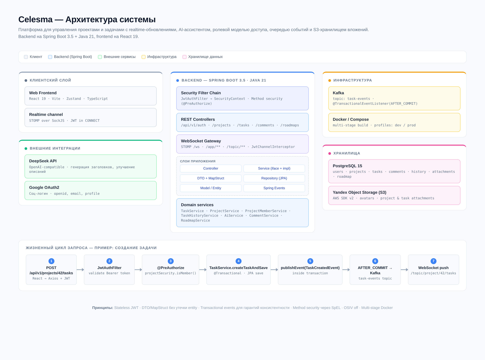

<p align="center">
  
</p>

# Celesma

Платформа для управления проектами и задачами с **realtime-обновлениями**, **AI-ассистентом**, **ролевой моделью доступа**, **историей изменений задач** и **S3-хранилищем вложений**. Аналог упрощённого Jira/Trello с фокусом на совместную работу команд небольших и средних проектов.

> README фронтенда: [celesma-frontend](https://github.com/dispixxx/celesma-frontend)

---

## Содержание

- [Технологии](#технологии)
- [Структура проекта](#структура-проекта)
- [Быстрый старт](#быстрый-старт)
- [Конфигурация](#конфигурация)
- [REST API](#rest-api)
- [WebSocket-события](#websocket-события)
- [Kafka-события](#kafka-события)

---

## Технологии

### Backend
| Категория | Технология |
|-----------|------------|
| Язык | Java 21 (records, switch expressions, pattern matching) |
| Фреймворк | Spring Boot 3.5.4 |
| Web | Spring MVC, Spring WebSocket (STOMP + SockJS) |
| Безопасность | Spring Security, JWT (jjwt 0.12), OAuth2 Client |
| Данные | Spring Data JPA, Hibernate, PostgreSQL 15 |
| Маппинг | MapStruct 1.6 |
| Интеграции | Spring Kafka, AWS SDK v2 (S3), Spring OAuth2 |
| API-документация | springdoc-openapi (Swagger UI) |
| Валидация | Jakarta Bean Validation |

### Frontend
| Категория | Технология |
|-----------|------------|
| UI | React 19, TypeScript |
| Сборка | Vite 8 |
| Состояние | Zustand |
| Роутинг | React Router 7 |
| Realtime | @stomp/stompjs, sockjs-client |
| HTTP | Axios |
| Анимации | Framer Motion |

### Инфраструктура
- Docker (multi-stage build), Docker Compose (app + PostgreSQL)
- Профили Spring: `dev`, `prod`, `kafka`, `s3`

---

## Структура проекта

```
src/main/java/com/disp/celesma/
├── CelesmaApplication.java          # Точка входа
├── controller/                      # REST + WebSocket контроллеры
├── service/                         # Бизнес-логика (Task, Project, Auth, AI...)
├── repository/                      # Spring Data JPA репозитории
├── model/                           # JPA-сущности + enums
├── dto/                             # Data Transfer Objects (records)
├── mapper/                          # MapStruct-мапперы entity ↔ DTO
├── event/                           # Spring Application Events
├── kafka/                           # Интеграция с Apache Kafka (профиль `kafka`)
├── s3/                              # S3 (Yandex Object Storage)
├── security/                        # JWT-аутентификация и авторизация
├── config/                          # Spring-конфигурации
└── exception/                       # Глобальная обработка ошибок
```

---

## Быстрый старт

### Предварительные требования

- **JDK 21+**, **Maven 3.9+**
- **Docker** и **Docker Compose** (опционально, но рекомендуется)
- **PostgreSQL 15+** (если запускаешь без Docker)
- **Yandex Cloud аккаунт** с Object Storage — можно запускать и без S3, фичи будут недоступны
- **DeepSeek API key** — для AI-функций (можно заглушить)
- **Google OAuth2 credentials** — для входа через Google (можно заглушить)

### Вариант 1: Docker Compose (рекомендуется)

```bash
git clone https://github.com/dispixxx/celesma-api.git
cd celesma-api

docker compose up --build
```

`docker-compose.yml` поднимает только `db` + `app` с dev-заглушками (`JWT_SECRET`, `GOOGLE_CLIENT_ID/SECRET` уже прописаны в файле, `.env` не используется). **AI (DeepSeek) и S3 в этом варианте недоступны** — их переменные не проброшены в контейнер. Чтобы включить AI/S3, добавь нужные переменные в блок `environment` сервиса `app` (см. [Конфигурацию](#конфигурация)) или запусти локально (Вариант 2).

После старта: API — http://localhost:8080, Swagger UI — http://localhost:8080/swagger-ui.html

### Вариант 2: Локальный запуск (разработка)

```bash
docker run -d --name celesma-db \
  -e POSTGRES_DB=celesma_db -e POSTGRES_USER=postgres -e POSTGRES_PASSWORD=postgres \
  -p 5432:5432 postgres:15-alpine

export JWT_SECRET="dev-secret-key-at-least-32-characters-long-enough"
export DEEPSEEK_API_KEY="sk-..."
export GOOGLE_CLIENT_ID="..."
export GOOGLE_CLIENT_SECRET="..."
export SPRING_DATASOURCE_URL="jdbc:postgresql://localhost:5432/celesma_db"
export SPRING_DATASOURCE_USERNAME="postgres"
export SPRING_DATASOURCE_PASSWORD="postgres"

mvn spring-boot:run -Dspring-boot.run.profiles=dev
```

### Вариант 3: С Kafka (профиль `kafka`)

Подними Kafka (например, через `bitnami/kafka:3.7` в KRaft-режиме на порту 9092), затем:

```bash
mvn spring-boot:run -Dspring-boot.run.profiles=dev,kafka
```

### Frontend

```bash
git clone https://github.com/dispixxx/celesma-frontend.git
cd celesma-frontend
npm install
npm run dev
```

Frontend доступен на http://localhost:3000, проксирует запросы на backend:8080.

---

## Конфигурация

Все секреты передаются через переменные окружения. Базовые настройки в `application.properties`, профиль-специфичные в `application-{profile}.properties`.

| Переменная | Описание | Обязательная |
|------------|----------|--------------|
| `SPRING_DATASOURCE_URL` | URL подключения к PostgreSQL | Да |
| `SPRING_DATASOURCE_USERNAME` / `_PASSWORD` | Учётные данные БД | Да |
| `JWT_SECRET` | Секрет для подписи JWT (мин. 32 символа) | Да |
| `DEEPSEEK_API_KEY` | API-ключ DeepSeek для AI-функций | Для AI |
| `GOOGLE_CLIENT_ID` / `_SECRET` | OAuth2 credentials Google | Для Google login |
| `STORAGE_BUCKET_NAME` / `STORAGE_ENDPOINT` | Параметры бакета Yandex S3 | Для S3 |
| `AWS_ACCESS_KEY_ID` / `AWS_SECRET_ACCESS_KEY` | Ключи доступа к S3 | Для S3 |
| `SPRING_PROFILES_ACTIVE` | Активные профили (`dev,kafka,s3`) | Нет |

Пример `.env` — см. `.env.example` в корне репозитория.

---

## REST API

Базовый префикс: `/api/v1`. Полная интерактивная документация — в Swagger UI: http://localhost:8080/swagger-ui.html

### Аутентификация

| Метод | Путь | Описание |
|-------|------|----------|
| `POST` | `/auth/register` | Регистрация по email + пароль |
| `POST` | `/auth/login` | Вход, возвращает JWT |
| `GET` | `/auth/oauth2/google` | Редирект на Google OAuth2 |

### Проекты

| Метод | Путь | Описание | Auth |
|-------|------|----------|------|
| `GET` | `/projects` | Список проектов текущего пользователя | JWT |
| `POST` | `/projects` | Создать проект (становишься OWNER) | JWT |
| `GET` | `/projects/{id}` | Детали проекта | member |
| `PATCH` | `/projects/{id}` | Обновить проект | privileged |
| `DELETE` | `/projects/{id}` | Удалить проект | owner |
| `GET` | `/projects/{id}/members` | Список участников | member |
| `POST` | `/projects/{id}/applicants` | Подать заявку на вступление | JWT |
| `POST` | `/projects/{id}/applicants/{userId}/accept` | Принять заявку | privileged |

### Задачи

| Метод | Путь | Описание | Auth |
|-------|------|----------|------|
| `GET` | `/projects/{projectId}/tasks` | Список задач проекта | member |
| `POST` | `/projects/{projectId}/tasks` | Создать задачу | member |
| `GET` | `/tasks/{taskId}` | Получить задачу | member |
| `PUT` | `/tasks/{taskId}` | Обновить задачу | creator/assignee/privileged |
| `PATCH` | `/tasks/{taskId}/status` | Сменить статус | member |
| `PATCH` | `/tasks/{taskId}/title` | Обновить заголовок | member |
| `DELETE` | `/tasks/{taskId}` | Удалить задачу | privileged |
| `GET` | `/tasks/{taskId}/history` | История изменений | member |
| `POST` | `/tasks/{taskId}/attachments` | Загрузить вложение | member |
| `DELETE` | `/tasks/{taskId}/attachments/{attachmentId}` | Удалить вложение | uploader/privileged |

### AI

| Метод | Путь | Описание |
|-------|------|----------|
| `POST` | `/tasks/generate-title` | Сгенерировать заголовок по описанию |
| `POST` | `/tasks/ai-process` | Действия: `TITLE`, `IMPROVE`, `FORMALIZE`, `SUBTASKS` |

### Пример запроса

```http
POST /api/v1/projects/42/tasks HTTP/1.1
Authorization: Bearer eyJhbGciOi...
Content-Type: application/json

{
  "title": "Реализовать экспорт задач в CSV",
  "description": "Нужна кнопка экспорта текущих задач проекта в CSV-файл...",
  "assigneeId": 7,
  "priority": "HIGH",
  "endDate": "2025-08-15"
}
```

---

## WebSocket-события

Подключение: `ws://localhost:8080/ws` (SockJS). В STOMP-фрейме `CONNECT` нужно передать заголовок `Authorization: Bearer <jwt>` — проверяется `JwtChannelInterceptor`.

| Канал (subscribe) | Тип события |
|-------------------|-------------|
| `/topic/project/{projectId}/tasks` | Создание/обновление/смена статуса задачи в проекте |
| `/topic/task/{taskId}/comments` | Новый или обновлённый комментарий в задаче |

| Endpoint (send) | Назначение |
|-----------------|------------|
| `/app/task/{taskId}/comment` | Отправить комментарий в задачу |

---

## Kafka-события

Активируется профилем `kafka`. Topic: **`task-events`**, 3 партиции, ключ — `taskId`.

Типы событий: `TASK_CREATED`, `TASK_STATUS_CHANGED`. Пример payload:

```json
{
  "eventType": "TASK_STATUS_CHANGED",
  "taskId": 123,
  "taskTitle": "...",
  "projectId": 42,
  "projectName": "...",
  "assigneeId": 7,
  "assigneeUsername": "anna",
  "creatorId": 3,
  "creatorUsername": "max",
  "oldStatus": "IN_PROGRESS",
  "newStatus": "COMPLETED",
  "occurredAt": "2025-06-28T13:00:00"
}
```
